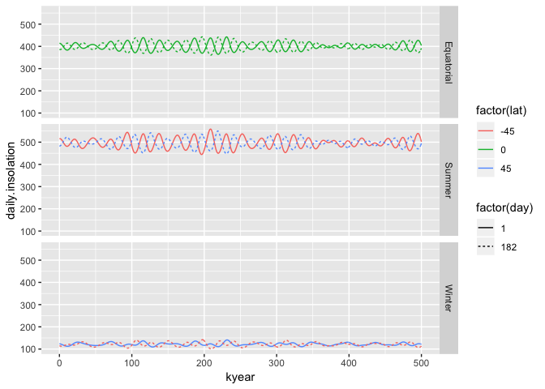

<!-- README.md is generated from README.Rmd. Please edit that file -->
orbitalforcing
==============

The goal of orbitalforcing is to ...

``` r
library(orbitalforcing)
library(tidyverse)
#> ── Attaching packages ────────────────────────────────────────────────────────────────────────────── tidyverse 1.2.1 ──
#> ✔ ggplot2 3.1.0     ✔ purrr   0.2.5
#> ✔ tibble  2.0.1     ✔ dplyr   0.7.8
#> ✔ tidyr   0.8.2     ✔ stringr 1.3.1
#> ✔ readr   1.2.1     ✔ forcats 0.3.0
#> ── Conflicts ───────────────────────────────────────────────────────────────────────────────── tidyverse_conflicts() ──
#> ✖ dplyr::filter() masks stats::filter()
#> ✖ dplyr::lag()    masks stats::lag()
```

Annual insolation
-----------------

``` r
tb <- crossing(kyear = 0:1e02,
             lat = seq(0, 90, 10)) %>% 
  group_by(lat) %>% 
  mutate(annual.insolation = AnnualInsolation(kyear, lat))

tb %>% 
  ggplot(aes(kyear, annual.insolation, colour = factor(lat))) +
  geom_line() +
  expand_limits(y = 0)
```


Daily insolation
----------------

``` r
tb <- crossing(kyear = 0:5e02,
               lat = c(-45, 0, 45),
               day = c(1, 182)) %>% 
  group_by(lat) %>% 
  mutate(daily.insolation = DailyInsolation(kyear, lat, day)$Fsw,
         season = ifelse(daily.insolation > 200, "Summer", "Winter"),
         season = ifelse(lat == 0, "Equatorial", season))

tb %>% 
  #filter(lat == 50) %>% 
  ggplot(aes(kyear, daily.insolation, colour = factor(lat), group = paste(day, season, lat), linetype = factor(day))) +
  geom_line() +
  facet_grid(season~.) 
```



Max - Min Insolation
--------------------

``` r
tb.range <- tb %>% 
  select(-season) %>% 
  spread(day, daily.insolation) %>% 
  mutate(range.insolation = abs(`1` - `182`))

tb.range %>% 
  ggplot(aes(x = kyear, y = range.insolation,
             colour = factor(lat), group = lat)) +
  geom_line()
```


``` r
PlotWorld <- function(){
  world <- map_data("world")
  worldmap <- ggplot(world, aes(x = long, y = lat, group = group)) +
    geom_polygon(fill = "Grey") +
    coord_quickmap() +
    scale_x_continuous(limits = c(-180, 180), breaks = seq(-180, 180, 60))+
    scale_y_continuous(limits = c(-90, 90), breaks = c(-45, 0, 45)) +
    labs(x = "Longitude", y = "Latitude") +
    theme_bw()
  worldmap
}
```

``` r
PlotWorld() +
  geom_tile(data = glob.grid, aes(x = lon, group = max.amp, fill = max.amp)) +
  scale_fill_viridis_c(option = "inferno") +
  expand_limits(fill = 0)
#> 
#> Attaching package: 'maps'
#> The following object is masked from 'package:purrr':
#> 
#>     map
```


``` r


PlotWorld() +
  geom_tile(data = glob.grid, aes(x = lon, group = min.amp, fill = min.amp))+
  scale_fill_viridis_c(option = "inferno")+
  expand_limits(fill = 0)
```


``` r

PlotWorld() +
  geom_tile(data = glob.grid, aes(x = lon, group = amp.diff, fill = amp.diff))+
  scale_fill_viridis_c(option = "inferno")+
  expand_limits(fill = 0)
```


